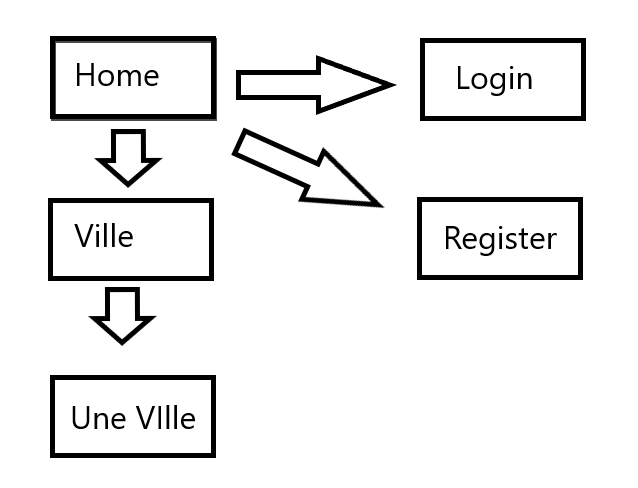

# Projet e-Shop #
Par Antonin Demaneche B1B

## 1 - Le projet ##

### 1.1 - Le Contexte du Projet ###

Le projet E-Shop est donc un projet d'UF mis en place par **Ynov Bordeaux** pour les Bachelors 2. Nous devions réaliser un site web tout en utilisant un **frameworks Web**.Le site web en questions devait rassembler certaines fonctionaliés mais aussi avoir un inspect plus individuel.

### 1.2 - Mon Projet ###

Mon projet devait donc être un **site de partage de photos** où il aurait été possible de noter positivement ou négativement les photos postées, via un **systéme de Like ou de dislike**.

### 1.3 - Les Outils Utilisés ###

J'ai décidé d'utiliser ``` Vue.Js ```  et ``` Firebase ``` pour mon projet.
J'ai décidé d'utiliser Vue car je me sentais simplement plus à l'aise avec celui-ci, bien que j'avais pu essayer d'autre frameworks avant qui ne m'ont pas séduit.
Pour la base de donnée, j'ai utilisé Firebase car je souhaitais me former à quelques chose de différent que SQL.

## 2 - Le Site ##

### 2.1 - L'architecture du site ###

Le site compte donc plusieurs pages, pour un total de 5 pages. On arrive sur la page "home", depuis celle-ci nous pouvons aller nous enregistrer, nous connecter ou aller voir la liste des villes existantes. Sur la page des villes nous avons plusieur choix de ville que nous pouvons consulter.


### 2.2 - La Base de Donnée ###

La base de donnée quant à elle est plutôt simple elle contient une seule table "City" avec les nom des villes, leurs nombres de likes ainsi que leurs nombres de photos.
La base de donnée avec firebase gére aussi la connexion.
J'aurai aussi aimé que le storage inclus dans firebase puisse héberger les images mais sans succés.

### 2.3 - Les fonctionalitées ###

Fonctionalitées : Il est possible de s'inscrire et de se connecter, des boutons s'affichent en fonction de si l'utilisateur est connecté ou non. Certaines pages ne sont pas accescibles si l'on n'est pas connecté et il n'est pas possible de poster des photos ni même de les "liker".